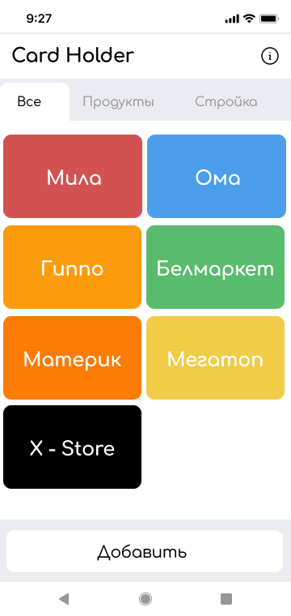

# Card Holder
 

<h3>Digitize your discount cards</h3>
<h4> Manage all your cards in one app. Put your wallet in order by scanning the code from the plastic cards of stores. After that, you will always have all your cards.</h4>


<h3>Choose you theme</h3>
DAY
<p align="start">
  
  
  
  
</p>

Night
<p align="start">
  
  
  
  
</p>


## Tags

- Kotlin
- Clean Architecture
- MVVM
- DataBinding
- DI (Dagger Injection)
- androidx.room

## Libs

- [ZXing Android Embedded][1]
- [Dagger Injection][3]

## Copyright

[//]: # (Licensed under the [Apache License 2.0][2])

```xml
Copyright (C) 2012 The Dagger Authors
Copyright (C) 2012-2022 ZXing authors, Journey Mobile
```

[1]: https://github.com/journeyapps/zxing-android-embedded
[2]: http://www.apache.org/licenses/LICENSE-2.0
[3]: https://github.com/google/dagger
